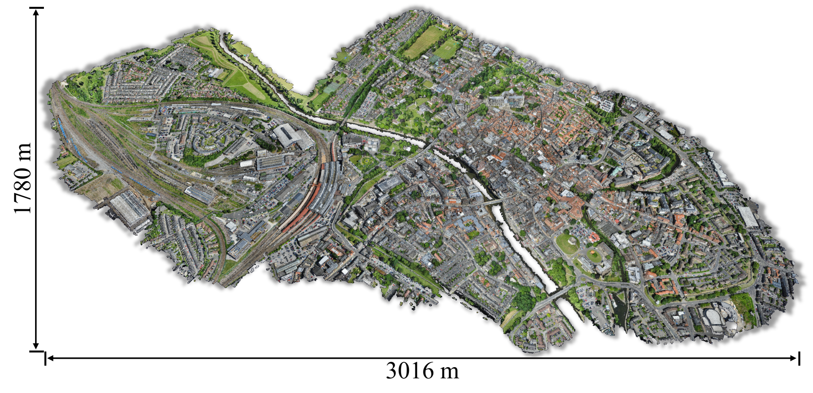
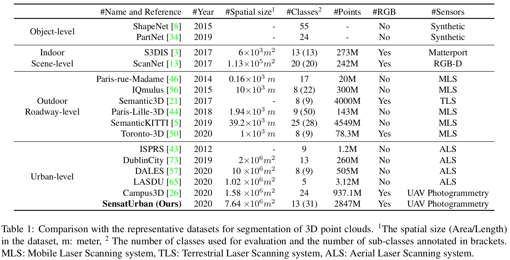
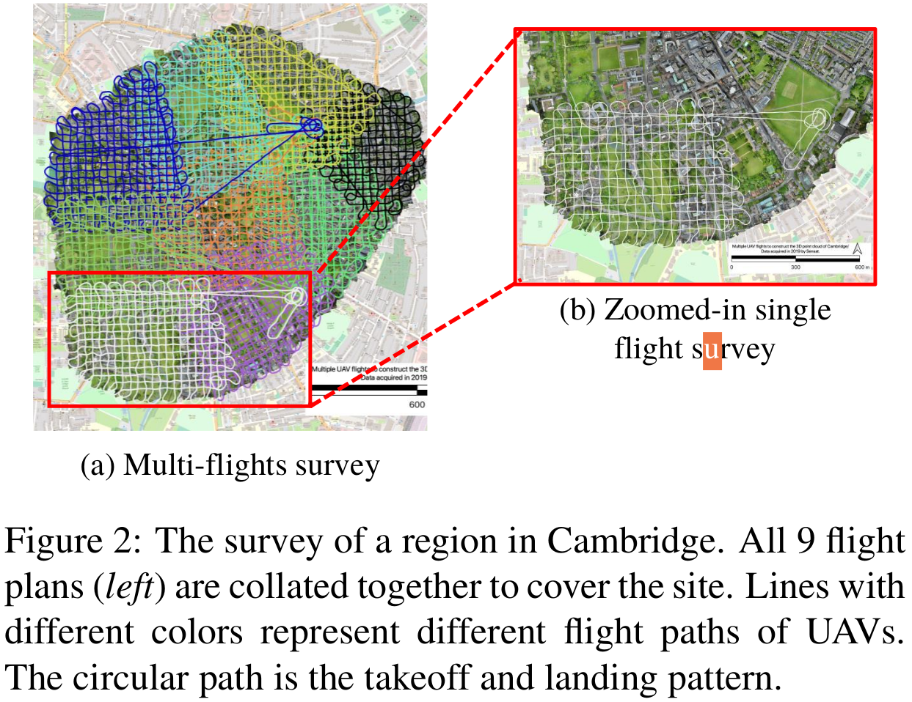
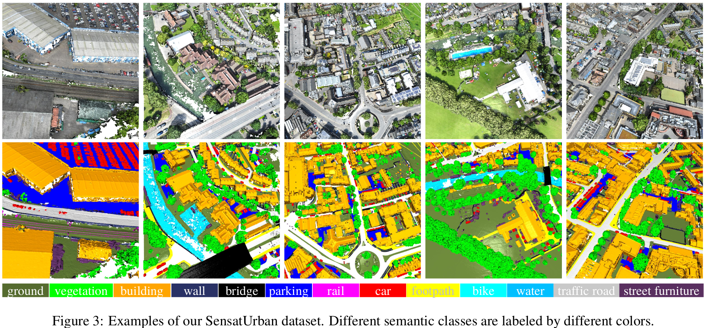
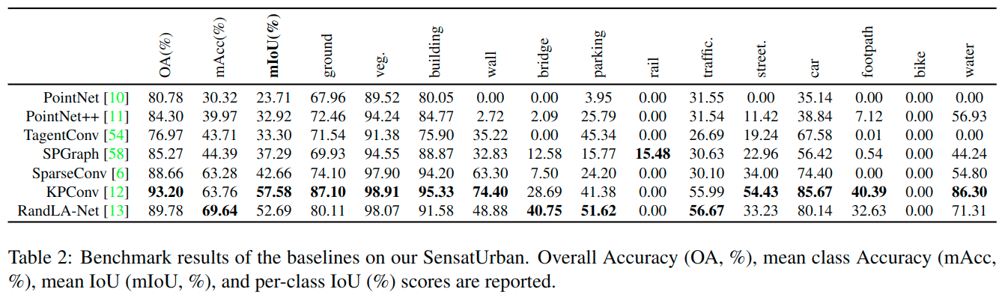

[](https://arxiv.org/abs/2009.03137)
[](https://github.com/QingyongHu/SensatUrban)


# Towards Semantic Segmentation of Urban-Scale 3D Point Clouds: A Dataset, Benchmarks and Challenges

This is the official repository of the **SensatUrban** dataset. For technical details, please refer to:

**Towards Semantic Segmentation of Urban-Scale 3D Point Clouds: A Dataset, Benchmarks and Challenges** <br />
[Qingyong Hu](https://qingyonghu.github.io/), [Bo Yang*](https://yang7879.github.io/), [Sheikh Khalid](https://uk.linkedin.com/in/fakharkhalid), 
[Wen Xiao](https://www.ncl.ac.uk/engineering/staff/profile/wenxiao.html), [Niki Trigoni](https://www.cs.ox.ac.uk/people/niki.trigoni/), [Andrew Markham](https://www.cs.ox.ac.uk/people/andrew.markham/). <br />
**[[Paper](http://arxiv.org/abs/2009.03137)] [[Blog](https://zhuanlan.zhihu.com/p/259208850)] [[Video](https://www.youtube.com/watch?v=IG0tTdqB3L8)] [[Project page](https://github.com/QingyongHu/SensatUrban)] [[Download](https://forms.gle/m4HJiqZxnq8rmjc8A)] 
[[Evaluation](https://competitions.codalab.org/competitions/31519#participate-submit_results)]
[[Urban3D workshop@ECCV2022](https://urban3dchallenge.github.io/)]** <br />

**We are hosting the 2nd Urban3D Challenge at ECCV 2022, please refer to [this page](https://urban3dchallenge.github.io/) for more details.**


### (1) Dataset

#### 1.1 Overview

This dataset is an urban-scale photogrammetric point cloud dataset with nearly three billion richly annotated points, 
which is five times the number of labeled points than the existing largest point cloud dataset. 
Our dataset consists of large areas from two UK cities, covering about 6 km^2 of the city landscape. 
In the dataset, each 3D point is labeled as one of 13 semantic classes, such as *ground*, *vegetation*, 
*car*, *etc.*. 

<p align="center">  </p>
<p align="center">  </p>

#### 1.2 Data Collection

The 3D point clouds are generated from high-quality aerial images captured by a 
professional-grade UAV mapping system. In order to fully and evenly cover the survey area, 
all flight paths are pre-planned in a grid fashion and automated by the flight control system (e-Motion).

<p align="center">  </p>

#### 1.3 Semantic Annotations

<p align="center">  </p>

- Ground: including impervious surfaces, grass, terrain
- Vegetation: including trees, shrubs, hedges, bushes
- Building: including commercial / residential buildings
- Wall: including fence, highway barriers, walls
- Bridge: road bridges
- Parking: parking lots
- Rail: railroad tracks
- Traffic Road: including main streets, highways
- Street Furniture: including benches, poles, lights
- Car: including cars, trucks, HGVs
- Footpath: including walkway, alley
- Bike: bikes / bicyclists
- Water: rivers / water canals


#### 1.4 Statistics
<p align="center">  </p>


### (2) Benchmarks
We extensively evaluate the performance of state-of-the-art algorithms on our dataset 
and provide a comprehensive analysis of the results. In particular, we identify several key challenges 
towards urban-scale point cloud understanding. 

<p align="center">  </p>


### (3) Demo

<p align="center"> <a href="https://youtu.be/IG0tTdqB3L8"></a> </p>


### (4) Training and Evaluation
Here we provide the training and evaluation script of [RandLA-Net](https://github.com/QingyongHu/RandLA-Net) for your reference.
- Download the dataset 

Download the files named "data_release.zip" [here](https://forms.gle/m4HJiqZxnq8rmjc8A). Uncompress the folder and move it to `/Dataset/SensatUrban`.

- Setup the environment
```
conda create -n randlanet python=3.5
source activate randlanet
pip install -r helper_requirements.txt
sh compile_op.sh
```

- Preparing the dataset
```
python input_preparation.py --dataset_path $YOURPATH
cd $YOURPATH; 
cd ../; mkdir original_block_ply; mv data_release/train/* original_block_ply; mv data_release/test/* original_block_ply;
mv data_release/grid* ./
```
The data should organized in the following format:
```
/Dataset/SensatUrban/
          └── original_block_ply/
                  ├── birmingham_block_0.ply
                  ├── birmingham_block_1.ply 
		  ...
	    	  └── cambridge_block_34.ply 
          └── grid_0.200/
	     	  ├── birmingham_block_0_KDTree.pkl
                  ├── birmingham_block_0.ply
		  ├── birmingham_block_0_proj.pkl 
		  ...
	    	  └── cambridge_block_34.ply 
```

- Start training: (Please first modified the root_path)
```
python main_SensatUrban.py --mode train --gpu 0 
```
- Evaluation:
```
python main_SensatUrban.py --mode test --gpu 0 
```
- Submit the results to the server:
The compressed results can be found in `/test/Log_*/test_preds/submission.zip`. Then, feel free to submit this results to the 
[evaluation server](https://competitions.codalab.org/competitions/31519#participate-submit_results). 

- The Urban3D Challenge@ICCV2021 Forum:
Please scan the code to join our wechat group or drop a message [here](https://competitions.codalab.org/forums/28215/):
<p align="center">  </p>


### Citation
If you find our work useful in your research, please consider citing:

	@inproceedings{hu2020towards,
	  title={Towards Semantic Segmentation of Urban-Scale 3D Point Clouds: A Dataset, Benchmarks and Challenges},
	  author={Hu, Qingyong and Yang, Bo and Khalid, Sheikh and Xiao, Wen and Trigoni, Niki and Markham, Andrew},
    booktitle={Proceedings of the IEEE/CVF Conference on Computer Vision and Pattern Recognition},
	  year={2021}
	}


	@article{hu2022sensaturban,
  	title={Sensaturban: Learning semantics from urban-scale photogrammetric point clouds},
  	author={Hu, Qingyong and Yang, Bo and Khalid, Sheikh and Xiao, Wen and Trigoni, Niki and Markham, Andrew},
  	journal={International Journal of Computer Vision},
  	volume={130},
  	number={2},
  	pages={316--343},
  	year={2022},
  	publisher={Springer}
  }


### Updates
* 03/25/2022: we are organizing the [Urban3D@ECCV2022 - The 2nd Challenge on Large-Scale Point Clouds Analysis for Urban Scenes Understanding](https://urban3dchallenge.github.io/)!
* 01/03/2021: The SensatUrban has been accepted by CVPR 2021!
* 11/02/2021: The dataset is available for download!
* 07/09/2020: Initial release!


## Related Repos
1. [RandLA-Net: Efficient Semantic Segmentation of Large-Scale Point Clouds](https://github.com/QingyongHu/RandLA-Net) 
2. [SoTA-Point-Cloud: Deep Learning for 3D Point Clouds: A Survey](https://github.com/QingyongHu/SoTA-Point-Cloud) 
3. [3D-BoNet: Learning Object Bounding Boxes for 3D Instance Segmentation on Point Clouds](https://github.com/Yang7879/3D-BoNet) 
4. [SpinNet: Learning a General Surface Descriptor for 3D Point Cloud Registration](https://github.com/QingyongHu/SpinNet) 
5. [SQN: Weakly-Supervised Semantic Segmentation of Large-Scale 3D Point Clouds](https://github.com/QingyongHu/SQN) 
6. [Not All Points Are Equal: Learning Highly Efficient Point-based Detectors for 3D LiDAR Point Clouds](https://github.com/yifanzhang713/IA-SSD) 
7. [STPLS3D: A Large-Scale Synthetic and Real Aerial Photogrammetry 3D Point Cloud Dataset](https://github.com/meidachen/STPLS3D) 


