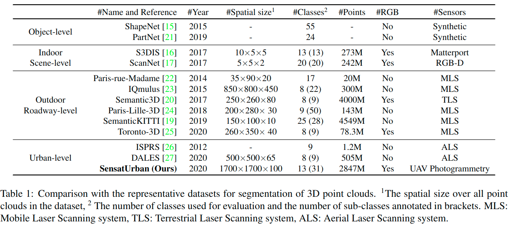
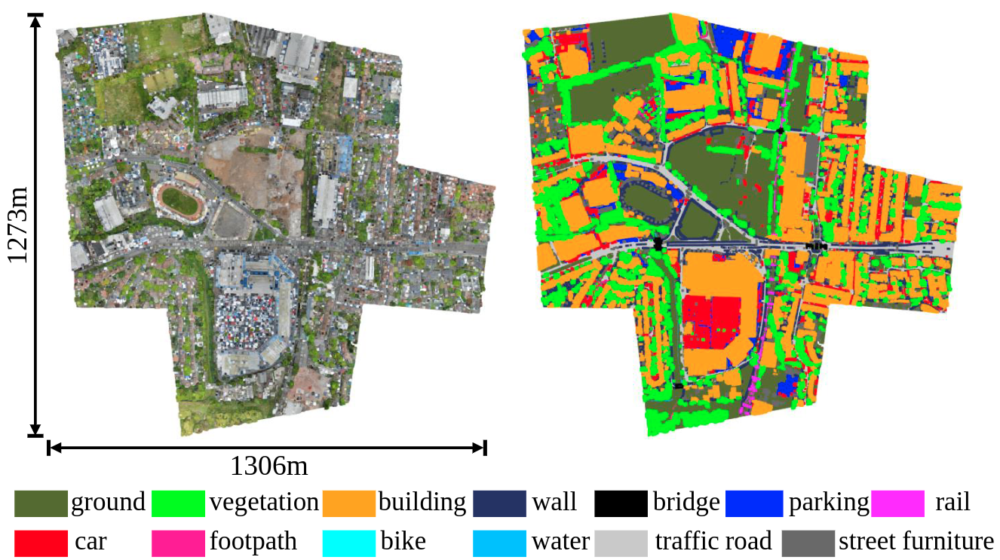
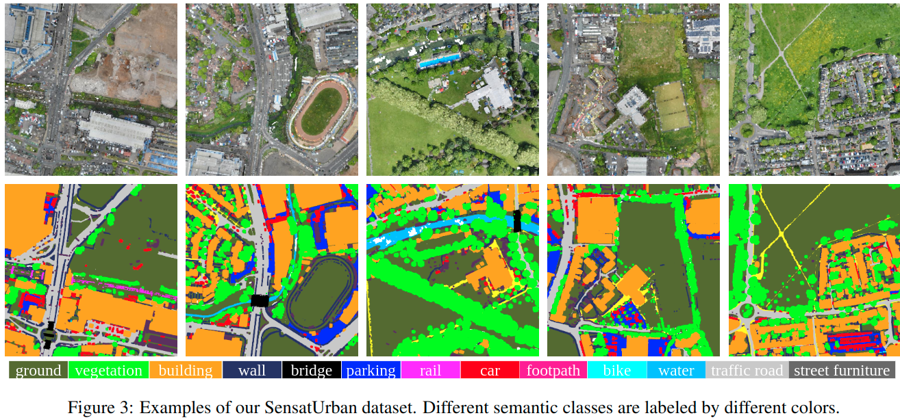
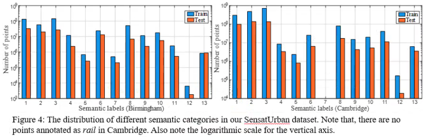

# Towards Semantic Segmentation of Urban-Scale 3D Point Clouds: A Dataset, Benchmarks and Challenges

This is the official repository of the **SensatUrban** dataset.

### (1) Dataset

This dataset is an urban-scale photogrammetric point cloud dataset with nearly three billion richly annotated points, 
which is five times the number of labeled points than the existing largest point cloud dataset. 
Our dataset consists of large areas from two UK cities, covering about 6 km^2 of the city landscape. 
In the dataset, each 3D point is labeled as one of 13 semantic classes, such as *ground*, *vegetation*, 
*car*, *etc.*. 

  

  

#### Data collection

The 3D point clouds are generated from high-quality aerial images captured by a 
professional-grade UAV mapping system. In order to fully and evenly cover the survey area, 
all flight paths are pre-planned in a grid fashion and automated by the flight control system (e-Motion).

  

#### Semantic Annotation

- Ground: including impervious surfaces, grass, terrain
- Vegetation: including trees, shrubs, hedges, bushes
- Building: including commercial / residential buildings
- Wall: including fence, highway barriers, walls
- Bridge: road bridges
- Parking: parking lots
- Rail: railroad tracks
- Traffic Road: including main streets, highways
- Street Furniture: including benches, poles, lights
- Car: including cars, trucks, HGVs
- Footpath: including walkway, alley
- Bike: bikes / bicyclists
- Water: rivers / water canals

  

#### Statistics

  

### (2) Benchmark

  

### (3) Demo

  

